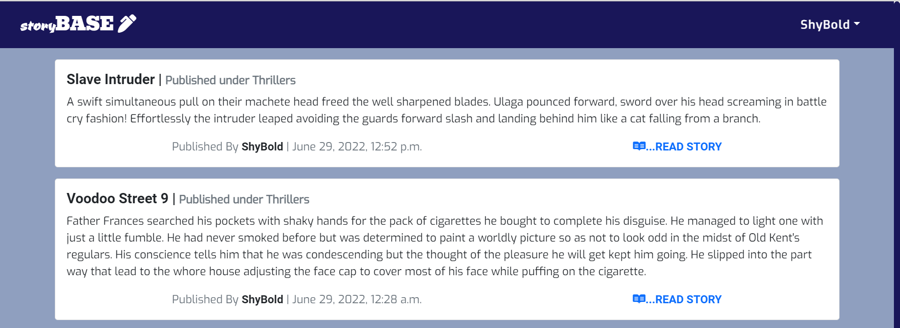
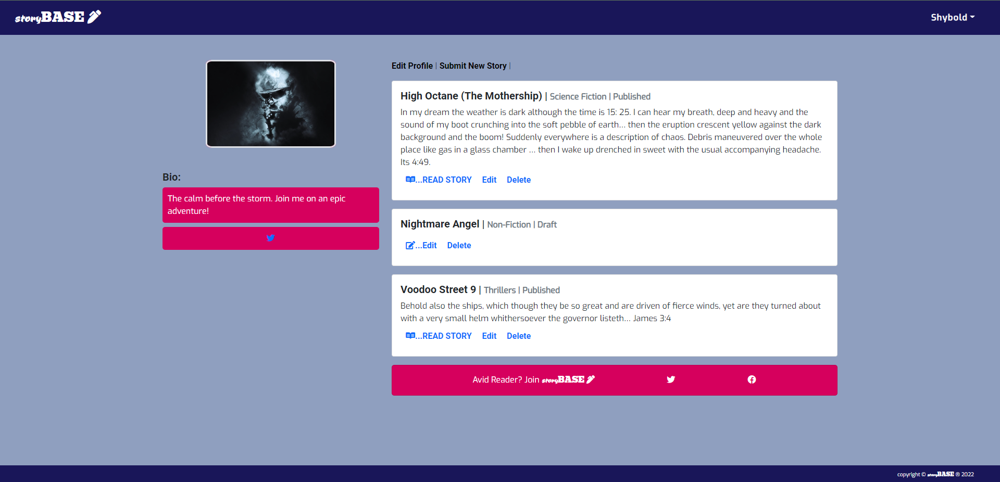
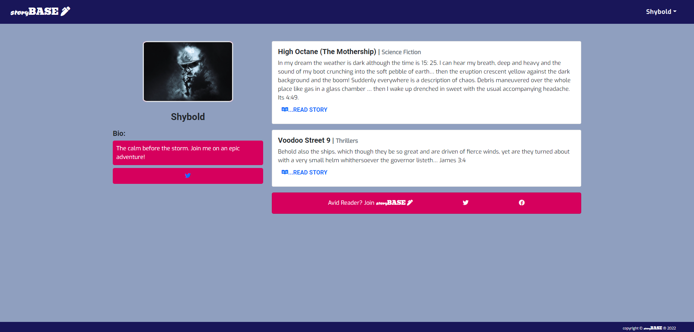
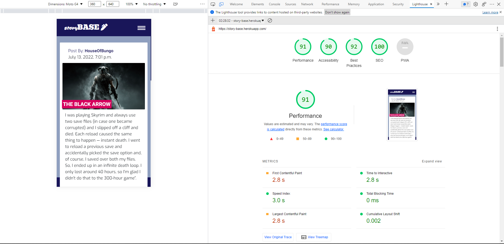

# StoryBase
StoryBase is a storytelling website created using Django framework. The site allows users to post thier creative ideas as story blogs. Stories are published into a set category chosen by the site admin. To post stories a site user must be registered and be logged in.
## Site Scope
* Responsive Design: storyBASE website should be fully responsive in all devices from screen size 280 upwards
* No loss to functionality between mobile devices and tablets or desktops
* Restrictions to key site features unless site user is registered and logged in
* Logged in users’ ability to perform full CRUD functionality to their profile and posts
* Logged in users ability to interact with posts

## Features
#### Responsiveness:
The site is responsive and can be easily accessed with full functionality in full screen, tablet and mobile screen

#### Navigation:
Navigation bar containing site logo that is also a home button and a login link beside a call to action register button

If user is logged in the registered username appears as a link to the far right. On click the username drops down to a tab with links to view the logged in user profile, submit new story or logout of the site.

on the home page, post by site users are listed in rows to the left in order of new to old posts and peginated by 20 post.

To the right of the home page is a list of categories chosen by the site admin and can only be modified by the site admin. Each category has a link to a page with only post listed under that category.

site users need to be logged in to view the category page.

Each post can be viewed in detail by clicking the Title of the post this takes the site user to a detail view page were logged in users can interact with the post by liking or disliking the post or leaving a public comment.
site users not logged in are requested to do so to be able to interact with the post they are viewing.

In addition to being able to interact with posts, registered users can also add, edit and delete own posts in a custom user page.

When each post is viewed, site users can also view a public profile of the author with a list of all the authors published post sorted in order of new to old.

### Features left to implement
* Follow Author functionality

### Model
Relational Database Model was used in this project

### Languages, Framework and Library
* HTML5 [More on HTML5 ](https://en.wikipedia.org/wiki/HTML5)
* CSS3 [More on CSS](https://en.wikipedia.org/wiki/CSS)
* Python [Python](https://www.python.org/) [Read More on Python](https://en.wikipedia.org/wiki/Python_(programming_language))
* Bootstarp 5 [Bootstrap](https://getbootstrap.com/)
* Django [Django](https://www.djangoproject.com/)
* JavaScript [More on JavaScript](https://en.wikipedia.org/wiki/JavaScript)
* Django-allauth [django-allauth read the doc](https://django-allauth.readthedocs.io/en/latest/)
* Cloudinary [Image hosting](https://cloudinary.com/)
* Crispy-form [django-crispy-form read the doc](https://django-crispy-forms.readthedocs.io/en/latest/install.html)
* Summernote [Summernote Docs](https://summernote.org/)

### Testing
The codes were tested by doing the following:
#### Manual Testing:
1.	Entered invalid inputs and wrong inputs where inputs are requested with respect to integers and strings.
2.	Recruited help from friends to use app and offer feedback
3.  Lunching site on different devices and browsers to check for responsiveness and bugs.
    * google chrom
    * fire fox
    * microsoft edge
    * Operamini

#### W3C CSS Validation: No Errors returned

#### Pep8 Validation: No errors returned

#### Accessibility:

Accessibility testing was conducted using light house devtools and it confirmed that the fonts and colors selected are easy to read and accecssible.

#### Unittest:
Unit test was created to test the form.py, views.py and models.py

### Bugs
* none found

### Deployment
The project was deployed to Heroku with the following steps:
1. create a Heroku account
2.  in the settings section reveal the config var and enter the key and value pair from the settings.py file
DJANGO_URL, SECRET_KEY, PORT and CLOUDINARY_URL
3.	on the Resources tab select Heroku Postgres as the database
4.	on the CLI create a requirements.txt file using the command “pip3 freeze –local > requirements.txt”
5.	Add a Procfile with the required codes in it
6.	Change Debug to False and commit repository to Github.
7. In the deploy section select github and search for the repository name. link up the Heroku app to the github repository code.
8. Scroll down and setup automatic deploy to allow Heroku to update app from gitpod push and click on the manual deploy option.
9. click view to view the app.
* View app here: [storyBASE](https://story-base.herokuapp.com/)

### Credits
* Code Institute [Code Institute](https://codeinstitute.net/ie/)
* Pixabay for the images used on the site [Pixabay](https://pixabay.com/)
* Ukachukwu Abimbola [@Nurse_Ukachukwu](https://twitter.com/nurse_ukachukwu) for external user testing.

### Awknowledgements
* Code Institute Tutor Assistance
* Caleb Mbakwe Mentor
* Sherifat and Olivia for all the love and support
